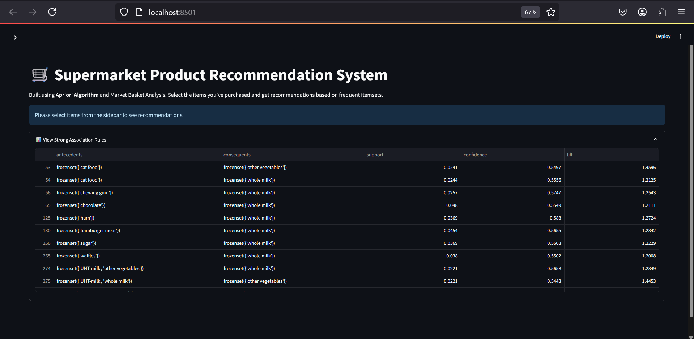

# 🛒 Supermarket Recommendation System


Apriori-based frequent itemset mining project using Python and MLxtend.
## 📸 Screenshots

### 🏠 Home Page


### 📊 Strong Association Rules


### 🛍️ Final Recommendations


This project uses the **Apriori algorithm** to identify frequent itemsets and generate product association rules from supermarket transaction data. The goal is to recommend items that are commonly purchased together, useful for retail strategies and inventory planning.

---

## Project Files

- `app.py`: Main Python script to run the Apriori model
- `Groceries_dataset.csv`: Dataset containing transactional data
- `requirements.txt`: Python dependencies
- `README.md`: Project documentation
- `screenshots/`: Project Output

---

## Features

- Applies Apriori algorithm via `mlxtend`
- Finds frequent itemsets with user-defined support
- Generates association rules with confidence and lift
- Displays product recommendations

---

## How to Run

1. **Clone the repository**  
   ```bash
   git clone https://github.com/your-username/supermarket-recommendation-system.git
   cd supermarket-recommendation-system
   ```

2. **Install dependencies**  
   ```bash
   pip install -r requirements.txt
   ```

3. **Run the script**  
   ```bash
   python app.py
   ```

---

## Sample Output

```
Frequent Itemsets:
[Milk, Bread] - Support: 0.18
[Eggs, Butter] - Support: 0.15

Association Rules:
If Milk → Bread (Confidence: 83%, Lift: 1.2)
If Eggs → Butter (Confidence: 75%, Lift: 1.3)
```

---

## Technologies Used

- Python
- Pandas
- Mlxtend (Apriori algorithm, association rule generation)

---

## Use Cases

- Product bundling
- Inventory arrangement
- Personalized shopping suggestions

---

## License

This project is licensed under the [MIT License](LICENSE).

---

## Author

**Sree Matangi**  
Final Year B.Tech (CSBS) | Data Science Enthusiast  
[LinkedIn](https://www.linkedin.com/in/sree-matangi-597942301) | Python · Java · SQL · ML